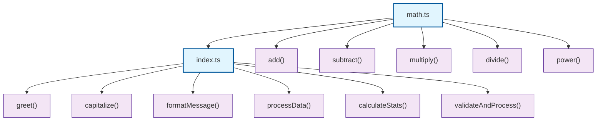

# Project Flow Diagram

Generated by Mermaid Agent 📊  
Created: 2025-09-21T08:22:57.210Z  
Agent: agent/mermaid-agent.ts  
Orchestrated by: agent/orchestrator.ts

## Architecture Overview

## Module Details

### index.ts

**Exported Functions:**
- `greet()`
- `capitalize()`
- `formatMessage()`
- `processData()`
- `calculateStats()`
- `validateAndProcess()`

**Dependencies:**
- `math.ts`

### math.ts

**Exported Functions:**
- `add()`
- `subtract()`
- `multiply()`
- `divide()`
- `power()`

## How to View

1. Copy the Mermaid code above
2. Paste it into [Mermaid Live Editor](https://mermaid.live/)
3. Or use any Mermaid-compatible viewer

## Legend

- 🟦 **Blue boxes**: TypeScript modules (.ts files)
- 🟪 **Purple boxes**: Exported functions
- ➡️ **Arrows**: Dependencies and relationships
